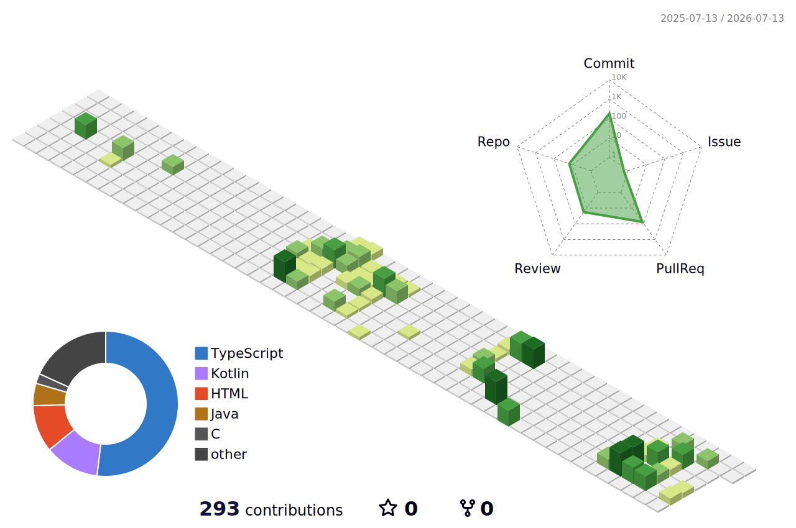

## 👋 Welcome to my GitHub

### ☁️ Cloud/DevOps Engineer · Backend Developer

---

# 🎓 Education & Experience

| Category | Details |
| :--- | :--- |
| 🎓 **University** | **Sogang University** Computer Science (5th Semester, On Leave) |
| ☁️ **Bootcamp** | LikeLion Cloud Engineering Bootcamp 4th (DevOps & AWS) |
| 🚀 **Internship** | LikeLion Rocketdan Internship 22nd |

---

# 🛠 Tech Stack

### ☁️ Cloud & DevOps

### 💻 Backend

### 🗄 Database

### 🌐 Frontend

---

# 📊 GitHub Stats

